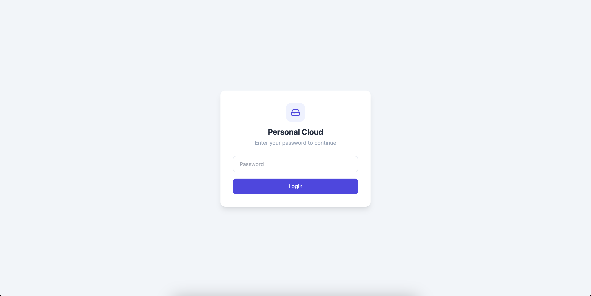
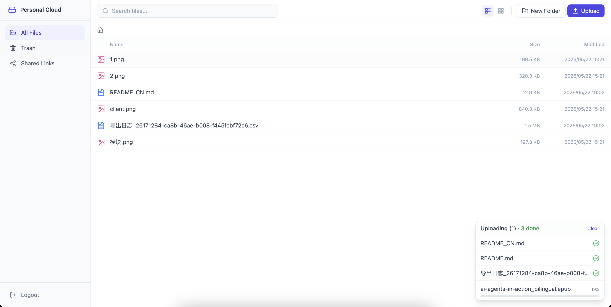
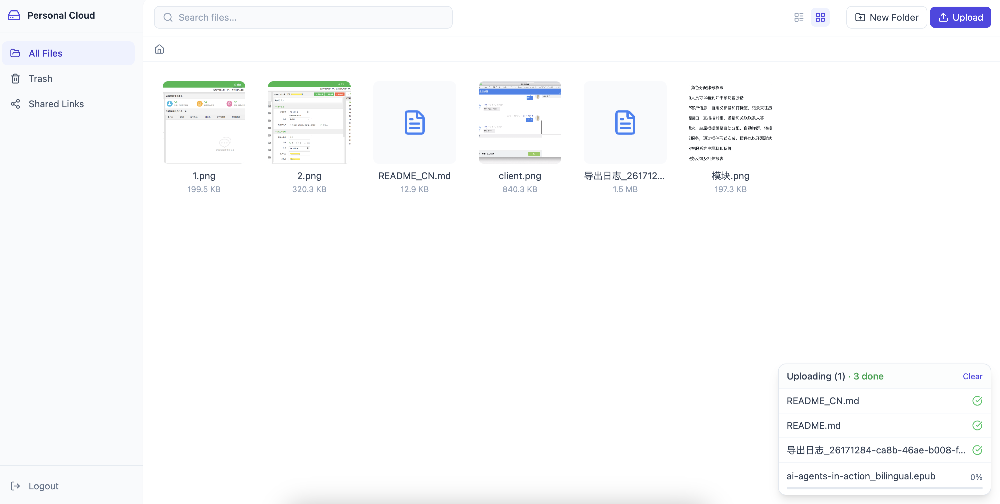
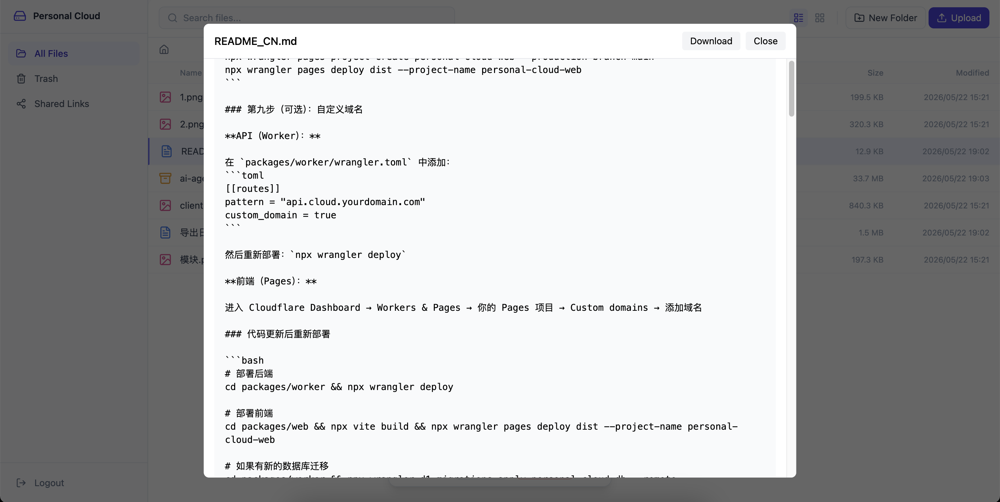
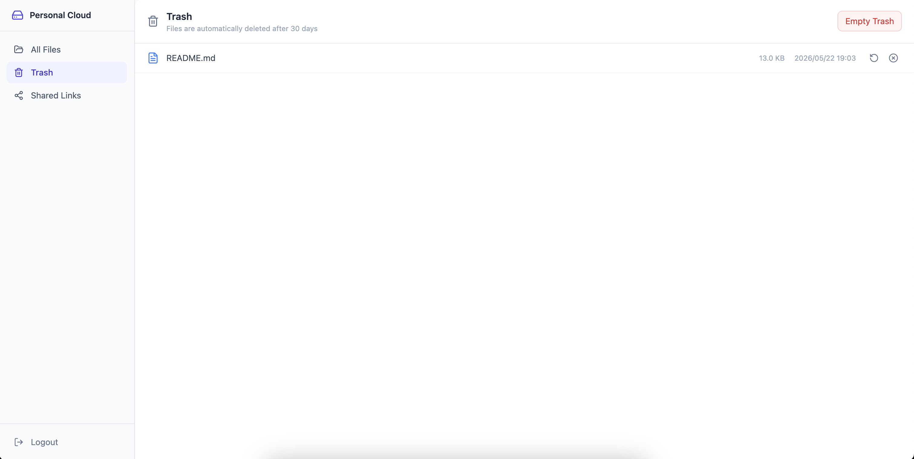
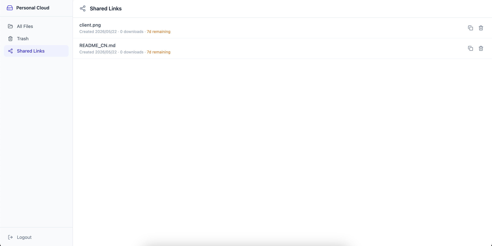
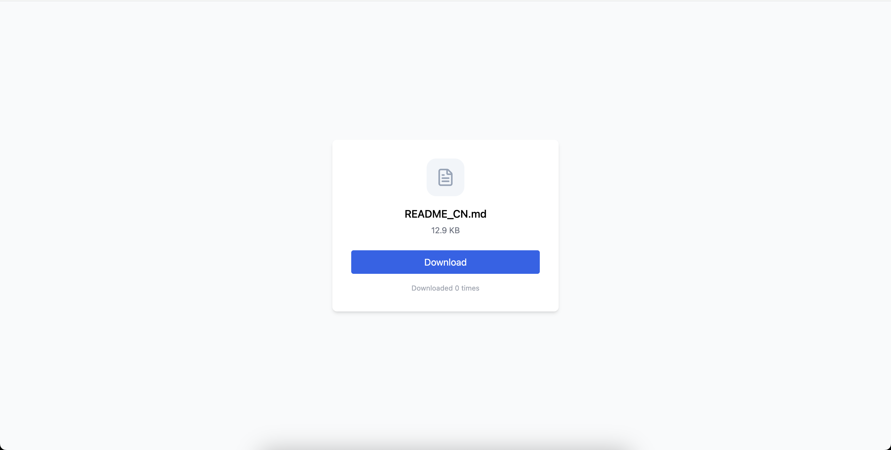

# Personal Cloud

A fast, self-hosted personal cloud storage built entirely on Cloudflare's edge infrastructure. Zero egress fees, global CDN, serverless — deploy your own Dropbox alternative in minutes.

<!-- TODO: Add a screenshot of the file manager UI here -->
<!--  -->

## Features

- **File Management** — Upload, download, rename, move, delete, create folders
- **Drag & Drop Upload** — Drop files anywhere, multipart chunked upload for large files with real-time progress
- **File Preview** — Images, video, audio, PDF, and text/code previewed inline
- **Grid & List Views** — Toggle between compact list and visual grid layout
- **Search** — Fuzzy search across all file names
- **Version History** — Automatic versioning when re-uploading same-named files, revert to any version
- **Trash & Recovery** — Soft delete with 30-day auto-cleanup, restore anytime
- **Share Links** — Password-protected, time-limited share links for public download
- **Keyboard Shortcuts** — Delete, Ctrl+A select all, F2 rename
- **Toast Notifications** — Visual feedback for all operations (loading → success/error)
- **Single User** — Simple password authentication, designed for personal use
- **Fully Serverless** — No servers to maintain, scales automatically

<!-- TODO: Add a GIF showing drag-and-drop upload here -->

## Tech Stack

| Layer | Technology |
|-------|-----------|
| Backend | [Hono](https://hono.dev) on Cloudflare Workers |
| Frontend | React 18 + TypeScript + Vite + Tailwind CSS |
| Object Storage | Cloudflare R2 (S3-compatible, zero egress) |
| Database | Cloudflare D1 (SQLite at the edge) |
| Icons | Lucide React |
| State | TanStack Query + Zustand |

## Architecture

```
┌─────────────────┐       ┌──────────────────────┐       ┌─────────────┐
│  React SPA      │──────▶│  Hono Worker (API)   │──────▶│  Cloudflare │
│  (CF Pages)     │       │                      │       │  R2         │
│                 │◀──────│  - File CRUD          │       └─────────────┘
│  - File manager │       │  - Auth (JWT)        │
│  - Preview      │       │  - Search            │       ┌─────────────┐
│  - Drag upload  │       │  - Share links       │──────▶│  Cloudflare │
└─────────────────┘       │  - Versioning        │       │  D1         │
                          └──────────────────────┘       └─────────────┘
                                   │
          ┌────────────────────────┤
          ▼                        ▼
┌──────────────────┐    ┌──────────────────────┐
│ Small files      │    │ Large files (≥10MB)   │
│ via Worker proxy │    │ Multipart direct to R2│
└──────────────────┘    └──────────────────────┘
```

- **Small files (<10MB)**: Uploaded through the Worker for simplicity
- **Large files (≥10MB)**: Chunked multipart upload directly to R2 (bypasses Worker size limits)
- **Downloads**: Streamed from R2 through the Worker with proper auth
- **Metadata**: All file/folder structure stored in D1; R2 only holds binary content

## Cost

### Free Tier (covers most personal use)

| Resource | Free Allowance | Enough for... |
|----------|---------------|---------------|
| R2 Storage | 10 GB/month | ~5,000 photos or ~200 documents |
| R2 Writes | 1M requests/month | ~33,000 uploads/day |
| R2 Reads | 10M requests/month | ~333,000 downloads/day |
| R2 Egress | **Always free** | Unlimited downloads, zero transfer fees |
| D1 Storage | 5 GB | Millions of file metadata records |
| D1 Reads | 5M rows/day | Far beyond personal use |
| D1 Writes | 100K rows/day | ~100K file operations/day |
| Workers | 100K requests/day | ~100K API calls/day |

### Paid Usage Estimates

| Storage | Monthly Cost | Notes |
|---------|-------------|-------|
| 50 GB | ~$0.60 | (50 - 10 free) × $0.015/GB |
| 100 GB | ~$1.35 | (100 - 10 free) × $0.015/GB |
| 500 GB | ~$7.35 | (500 - 10 free) × $0.015/GB |
| 1 TB | ~$15.21 | (1024 - 10 free) × $0.015/GB |

**The killer feature**: R2 has **zero egress fees**. Download your files as much as you want — no surprise bills.

### Comparison

| Solution | 100 GB/month | 1 TB/month | Egress |
|----------|-------------|-----------|--------|
| **Personal Cloud (R2)** | $1.35 | $15 | Free |
| AWS S3 | $2.30 | $23 | $0.09/GB |
| Google Cloud Storage | $2.60 | $26 | $0.12/GB |
| Backblaze B2 | $0.60 | $6 | Free (with CF) |

## Deployment

### Prerequisites

- [Node.js](https://nodejs.org/) 18+
- [pnpm](https://pnpm.io/) (`npm install -g pnpm`)
- A [Cloudflare account](https://dash.cloudflare.com/sign-up) (free tier works)

### Step 1: Clone and Install

```bash
git clone https://github.com/Panmax/personal-cloud.git
cd personal-cloud
pnpm install
```

### Step 2: Authenticate with Cloudflare

```bash
npx wrangler login
```

This opens your browser for OAuth authentication.

### Step 3: Create D1 Database

```bash
cd packages/worker
npx wrangler d1 create personal-cloud-db
```

Copy the output `database_id` and update `packages/worker/wrangler.toml`:

```toml
[[d1_databases]]
binding = "DB"
database_name = "personal-cloud-db"
database_id = "your-database-id-here"  # ← paste here
```

### Step 4: Apply Database Migrations

```bash
npx wrangler d1 migrations apply personal-cloud-db --remote
```

### Step 5: Set Secrets

Generate a JWT secret:
```bash
openssl rand -hex 32
```

Generate your password hash:
```bash
echo -n "your-password-here" | shasum -a 256 | cut -d' ' -f1
```

Set both as Worker secrets:
```bash
npx wrangler secret put JWT_SECRET
# Paste the random hex string

npx wrangler secret put AUTH_PASSWORD_HASH
# Paste the SHA-256 hash of your password
```

### Step 6: Deploy the API (Worker)

```bash
npx wrangler deploy
```

Note the Worker URL (e.g., `https://personal-cloud-api.your-subdomain.workers.dev`).

### Step 7: Configure Frontend API Base

Edit `packages/web/.env.production`:
```
VITE_API_BASE=https://your-worker-url.workers.dev
```

If using a custom domain, set it to your API domain (e.g., `https://api.cloud.yourdomain.com`).

### Step 8: Deploy the Frontend (Pages)

```bash
cd packages/web
npx vite build
npx wrangler pages project create personal-cloud-web --production-branch main
npx wrangler pages deploy dist --project-name personal-cloud-web
```

### Step 9 (Optional): Custom Domains

**For the API (Worker):**

Add to `packages/worker/wrangler.toml`:
```toml
[[routes]]
pattern = "api.cloud.yourdomain.com"
custom_domain = true
```

Then redeploy: `npx wrangler deploy`

**For the Frontend (Pages):**

Go to Cloudflare Dashboard → Workers & Pages → your Pages project → Custom domains → Add `cloud.yourdomain.com`

### Updating After Code Changes

```bash
# Deploy backend
cd packages/worker && npx wrangler deploy

# Deploy frontend
cd packages/web && npx vite build && npx wrangler pages deploy dist --project-name personal-cloud-web

# If you added new migrations
cd packages/worker && npx wrangler d1 migrations apply personal-cloud-db --remote
```

## Local Development

```bash
# Terminal 1: Start the Worker (API on localhost:8787)
cd packages/worker
cp .dev.vars.example .dev.vars  # Edit with your password hash and JWT secret
pnpm db:migrate
pnpm dev

# Terminal 2: Start the Frontend (on localhost:5173, proxies to Worker)
cd packages/web
pnpm dev
```

Generate a local password hash:
```bash
echo -n "devpassword" | shasum -a 256 | cut -d' ' -f1
```

## Scheduled Tasks (Cron)

A daily cron job runs at **03:00 UTC** to perform automatic maintenance:

| Task | Description | Rule |
|------|-------------|------|
| Trash cleanup | Permanently deletes files that have been in trash for over 30 days | `deleted_at < now - 30d` |
| Version pruning | Removes old file versions (keeps latest 10 per file, deletes those older than 90 days) | `created_at < now - 90d AND version not in top 10` |
| Share link expiry | Removes share records that have passed their expiration date | `expires_at < now` |
| Orphan cleanup | Detects and removes files whose parent directory no longer exists (handles edge cases and historical data) | `parent_id NOT IN (SELECT id FROM files)` |

All cleanup tasks also delete the corresponding R2 objects, so you don't accumulate storage costs for deleted content.

## Data Storage

**R2 (Object Storage)** — Stores raw file content only, using keys in the format `{file_id}/{version_number}`.

**D1 (SQLite Database)** — Stores all metadata:

| Table | Purpose |
|-------|---------|
| `files` | File/folder tree structure, names, sizes, MIME types, soft-delete state |
| `file_versions` | Version history (r2_key + size for each historical version) |
| `shares` | Share link configuration (password hash, expiry, download count) |

## Upload Behavior

| Scenario | Behavior |
|----------|----------|
| Upload a new file | Creates new file record + stores in R2 |
| Upload same name in **same directory** | Creates a new version (old content preserved in version history) |
| Upload same name in **different directory** | Creates an independent file (no deduplication across directories) |
| Upload file ≥ 10MB | Uses multipart upload: chunks sent directly to R2, then metadata written to D1 |

## API Endpoints

<details>
<summary>Click to expand full API reference</summary>

### Authentication
| Method | Path | Description |
|--------|------|-------------|
| POST | `/api/auth/login` | Login with password, returns JWT |

### Files
| Method | Path | Description |
|--------|------|-------------|
| GET | `/api/files?parent_id=` | List directory contents |
| POST | `/api/files` | Create folder (JSON) or upload file (multipart) |
| GET | `/api/files/:id` | Get file details |
| PATCH | `/api/files/:id` | Rename or move |
| DELETE | `/api/files/:id` | Soft delete (to trash) |
| GET | `/api/files/:id/download` | Download file content |
| POST | `/api/files/batch` | Batch delete or move |

### Upload (Large Files)
| Method | Path | Description |
|--------|------|-------------|
| POST | `/api/upload/presign` | Initiate multipart upload |
| PUT | `/api/upload/part` | Upload a chunk |
| POST | `/api/upload/complete` | Finalize multipart upload |

### Versions
| Method | Path | Description |
|--------|------|-------------|
| GET | `/api/files/:id/versions` | List version history |
| POST | `/api/files/:id/revert` | Revert to a specific version |
| DELETE | `/api/files/:id/versions/:vid` | Delete a specific version |

### Trash
| Method | Path | Description |
|--------|------|-------------|
| GET | `/api/trash` | List trashed files |
| POST | `/api/trash/:id/restore` | Restore from trash |
| DELETE | `/api/trash/:id` | Permanently delete |

### Search
| Method | Path | Description |
|--------|------|-------------|
| GET | `/api/search?q=` | Fuzzy search by file name |

### Shares
| Method | Path | Description |
|--------|------|-------------|
| POST | `/api/shares` | Create share link |
| GET | `/api/shares` | List all shares |
| DELETE | `/api/shares/:id` | Revoke share link |

### Public (No Auth)
| Method | Path | Description |
|--------|------|-------------|
| GET | `/s/:id` | Get shared file info |
| POST | `/s/:id/download` | Download shared file |

</details>

## Screenshots

<!-- TODO: Add screenshots -->

### Login
<!--  -->

### File Manager (List View)
<!--  -->

### File Manager (Grid View)
<!--  -->

### File Preview
<!--  -->

### Trash
<!--  -->

### Share Links
<!--  -->

### Share Download Page
<!--  -->

## Testing

```bash
# Backend tests (35 integration + unit tests)
cd packages/worker && pnpm test

# Frontend tests (21 component + store tests)
cd packages/web && pnpm test
```

## Project Structure

```
personal-cloud/
├── packages/
│   ├── worker/              # Cloudflare Worker (API)
│   │   ├── src/
│   │   │   ├── index.ts     # Hono app entry + route mounting
│   │   │   ├── types.ts     # TypeScript interfaces
│   │   │   ├── cron.ts      # Scheduled cleanup tasks
│   │   │   ├── middleware/   # JWT auth middleware
│   │   │   ├── routes/       # API route handlers
│   │   │   ├── db/          # D1 query helpers
│   │   │   └── utils/       # JWT, nanoid, helpers
│   │   ├── migrations/      # D1 SQL schema
│   │   └── test/            # Integration tests
│   └── web/                 # React SPA (Cloudflare Pages)
│       └── src/
│           ├── pages/       # FilesView, TrashView, SharesView, Login, SharePage
│           ├── components/  # Reusable UI components
│           ├── hooks/       # React Query hooks, upload, keyboard
│           ├── stores/      # Zustand state management
│           └── utils/       # File icon helper
├── CLAUDE.md               # AI assistant context
└── README.md
```

## Contributing

Contributions are welcome! Please open an issue first to discuss what you'd like to change.

## License

MIT
